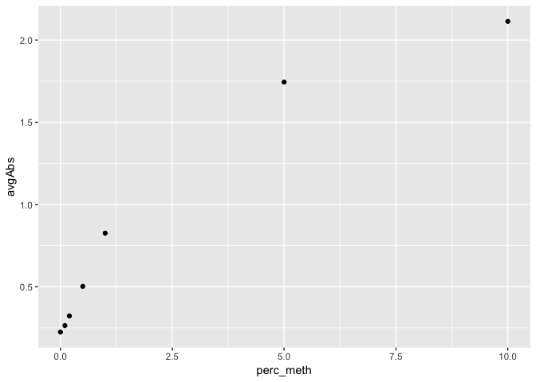
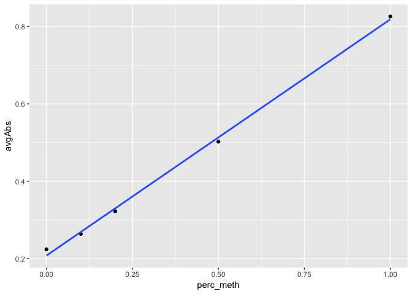
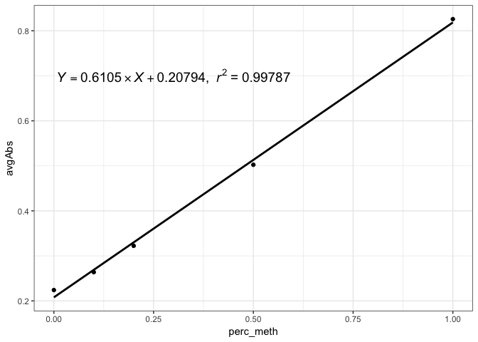
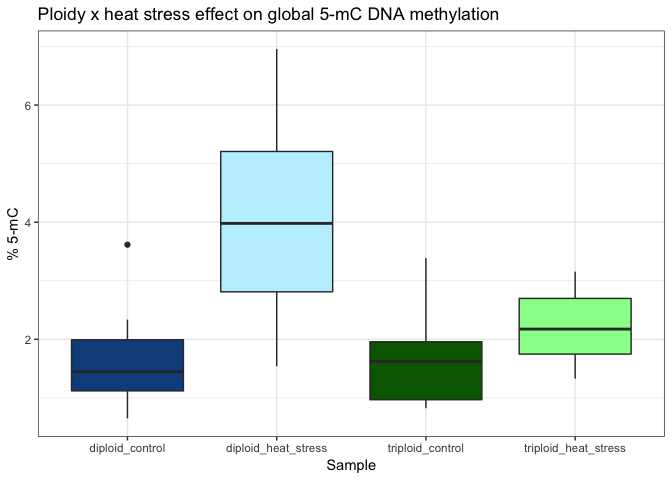

GlobalDNAMeth\_Polyploids
================
Shelly Trigg
2/12/2019

Load libraries

``` r
library(readxl)
```

    ## Warning: package 'readxl' was built under R version 3.4.4

``` r
library(dplyr)
```

    ## Warning: package 'dplyr' was built under R version 3.4.4

    ## 
    ## Attaching package: 'dplyr'

    ## The following objects are masked from 'package:stats':
    ## 
    ##     filter, lag

    ## The following objects are masked from 'package:base':
    ## 
    ##     intersect, setdiff, setequal, union

``` r
library(ggplot2)
```

    ## Warning: package 'ggplot2' was built under R version 3.4.4

``` r
library(broom)
```

Read in raw absorbance data files exported from plate reader. There are 3 files because I read the plate 3 independent times. The purpose for this was to make sure the readings were stable.

``` r
data1 <- read_xls("~/Documents/GitHub/C_gigas/Polyploids/docs/20190206_FirstReadingSTRIGG.xls")
data2 <- read_xls("~/Documents/GitHub/C_gigas/Polyploids/docs/20190206_2ndReadingSTRIGG.xls")
data3 <- read_xls("~/Documents/GitHub/C_gigas/Polyploids/docs/20190206_3rdReadingSTRIGG.xls")
```

Combine data frames into one data frame

``` r
Feb2019 <- merge(data1[,c(3,6)],data2[,c(3,6)], by = "Well")
Feb2019 <- merge(Feb2019,data3[,c(3,6)], by = "Well")
#simplify column names
colnames(Feb2019) <- c("Well", "Abs1", "Abs2", "Abs3")
```

Check that absorbance readings were stable

``` r
#calculate the mean reading for each of the three readings
Feb2019$mean <- apply(Feb2019[,2:4],1, mean)
#calculate the standard deviation for each of the three readings
Feb2019$sd <- apply(Feb2019[,2:4],1, sd)
#print the largest standard deviation
max(Feb2019$sd)
```

    ## [1] 0.01871462

**Stable readings conclusion:** SDs are very small between readings so go with readings from data1

Add sample names to data and remove wells that shouldn't be considered

``` r
#first read in sample names from plate map list
Feb_plateMap <- read_xlsx("~/Documents/GitHub/C_gigas/Polyploids/docs/20190131_Ronit'sSamplesforGlobalDNAMeth.xlsx", sheet = 3)

#make a list of samples to not be considered
rmv_wells <- c("no_sample", "contam", "no_ab")

#remove samples not to be considered from data frame
Feb_data <- merge(Feb_plateMap[which(!(Feb_plateMap$Sample %in% rmv_wells)),], data1[,c(3,6)])

#simplify absorbance column name
colnames(Feb_data)[4] <- "Absorbance"
```

Calculate average absorbance and SD for duplicate samples

``` r
#make a dataframe with mean absorbances for duplicate samples
Feb_data_avg <- Feb_data %>% group_by(Sample) %>% summarize(avgAbs=mean(Absorbance))
#make a dataframe with absorbance standard deviations for duplicate samples
Feb_data_sd <- Feb_data  %>% group_by(Sample) %>% summarize(SD=sd(Absorbance))
#merge mean absorbance and standard deviation dataframes into one dataframe
Feb_data_avg <- merge(Feb_data_avg,Feb_data_sd, by = "Sample")
#merge mean and standard deviation dataframe with sample info
Feb_data_avg <- unique(merge(Feb_data[,c("Type","Sample")], Feb_data_avg, by = "Sample"))
```

Generate standard curve

``` r
#make new data frame with only data from standards (STDs)
curve <- Feb_data_avg[grep("STD", Feb_data_avg$Type),]
print(curve)
```

    ##           Sample Type    avgAbs         SD
    ## 1  5 ul 0.1 % PC  STD 0.2638611 0.03423036
    ## 3  5 ul 0.2 % PC  STD 0.3223571 0.01964709
    ## 5   5 ul 0.5% PC  STD 0.5023909 0.08944630
    ## 7     5 ul 1% PC  STD 0.8258837 0.18597681
    ## 9     5 ul 5% PC  STD 1.7440975 0.09121277
    ## 11       5 ul NC  STD 0.2240971 0.02592295
    ## 13       5 ul PC  STD 2.1135561 0.04860726

``` r
#make new column for %meth
curve$perc_meth <- c(0.1,0.2,0.5,1,5,0,10)
#order data by perc_meth
curve <- curve[order(curve$perc_meth),]
print(curve)
```

    ##           Sample Type    avgAbs         SD perc_meth
    ## 11       5 ul NC  STD 0.2240971 0.02592295       0.0
    ## 1  5 ul 0.1 % PC  STD 0.2638611 0.03423036       0.1
    ## 3  5 ul 0.2 % PC  STD 0.3223571 0.01964709       0.2
    ## 5   5 ul 0.5% PC  STD 0.5023909 0.08944630       0.5
    ## 7     5 ul 1% PC  STD 0.8258837 0.18597681       1.0
    ## 9     5 ul 5% PC  STD 1.7440975 0.09121277       5.0
    ## 13       5 ul PC  STD 2.1135561 0.04860726      10.0

plot curve

``` r
ggplot(curve, aes(perc_meth, avgAbs)) + geom_point() 
```



last two points are plateauing so remove them

``` r
ggplot(curve[which(curve$perc_meth < 5.0),], aes(perc_meth, avgAbs)) + geom_point() 
```



find regression line

``` r
fit <- lm(curve[which(curve$perc_meth < 5.0),"avgAbs"] ~ curve[which(curve$perc_meth < 5.0),"perc_meth"] )
#find the R-squared
rsquared <- summary(fit)$r.squared
rsquared
```

    ## [1] 0.9978712

``` r
#[1] 0.9978712

#find the slope (https://www.cyclismo.org/tutorial/R/linearLeastSquares.html)
slope <- fit$coefficients[[2]]
slope
```

    ## [1] 0.6104974

plot regression line with equation and r-squared

``` r
#found this site helpful: (https://www.listendata.com/2016/07/add-linear-regression-equation-and.html)
linear = function(k) {
  z <- list(xx = format(coef(k)[1], digits = 5),
            yy = format(abs(coef(k)[2]), digits = 5),
            r2 = format(summary(k)$r.squared, digits = 5));
  if (coef(k)[1] >= 0)  {
    eq <- substitute(italic(Y) == yy %*% italic(X) + xx*","~~italic(r)^2~"="~r2,z)
  } else {
    eq <- substitute(italic(Y) == yy %*% italic(X) - xx*","~~italic(r)^2~"="~r2,z)  
  }
  as.character(as.expression(eq));              
}

x <- curve[which(curve$perc_meth < 5.0),"perc_meth"]
y <- curve[which(curve$perc_meth < 5.0),"avgAbs"]
fo = y ~ x
linplot <- ggplot(data = curve[which(curve$perc_meth < 5.0),], aes(x = perc_meth, y = avgAbs)) + geom_smooth(method = "lm", se=FALSE, color="black", formula = fo) +  geom_point() + theme_bw()
linplot1 = linplot + annotate("text", x = 0.3, y = 0.7, label = linear(lm(fo)), colour="black", size = 5, parse=TRUE)
linplot1
```



Calculate perc\_meth for samples using equation in EpiGentek MethylFlash kit manual: 5-mC% = (sample OD - NC OD) / (slope x input sample DNA in ng) \* 100%

``` r
#create an object for the absorbance of the NC (blank)
NC_OD <- Feb_data_avg[grep("5 ul NC", Feb_data_avg$Sample),"avgAbs"]
# create an object for product of the regression line slope and the ng DNA added in each of the wells
slopexDNAamt <- slope * 25

#create a new column in the dataframe with the NC_OD subtracted from the avg absorbance
Feb_data_avg$avgAbs_NC <- Feb_data_avg$avgAbs - NC_OD
#create a new column with the calculated percent methylation
Feb_data_avg$perc_meth <- Feb_data_avg$avgAbs_NC/slopexDNAamt *100
```

Add ploidy and treatment info to data

``` r
#make new data frame with only sample info
Feb_data_avg_Samples <- Feb_data_avg[which(Feb_data_avg$Type == "Sample"),]

#Add sample description to data frame. This loops through each line in Feb_data_avg_Samples and creates a new column 'ploidy' that gets filled in with "diploid" or "triploid" depending on whether the "Sample" name starts with a "D" or "T"; and creates a new column "treatment" that gets filled in with "heat_stress" or "control" depending on whether the number following the D or T is less than 10 or greater than 10. 
for (i in 1:nrow(Feb_data_avg_Samples)){
  if(substr(Feb_data_avg_Samples$Sample[i],1,1)=="D"){
    Feb_data_avg_Samples$ploidy[i] <- "diploid"
  }
  if(substr(Feb_data_avg_Samples$Sample[i],1,1)=="T"){
    Feb_data_avg_Samples$ploidy[i] <- "triploid"
  }
  if(as.numeric(substr(Feb_data_avg_Samples$Sample[i],2,3)) > 10){
    Feb_data_avg_Samples$treatment[i] <- "heat_stress"
  }
  if(as.numeric(substr(Feb_data_avg_Samples$Sample[i],2,3)) < 10){
    Feb_data_avg_Samples$treatment[i] <- "control"
  }
}

#make a new column which contains both ploidy and treatment info 
Feb_data_avg_Samples$condition <- paste(Feb_data_avg_Samples$ploidy, Feb_data_avg_Samples$treatment, sep = "_")
```

Plot absorbances vs. experimental group

``` r
ggplot(Feb_data_avg_Samples, aes(x = condition, y = perc_meth)) + geom_boxplot(aes(fill = condition), show.legend = F) + scale_fill_manual(values = c("dodgerblue4", "lightblue1", "darkgreen", "palegreen")) + xlab("Sample") + theme_bw() + ylab("% 5-mC") + ggtitle("Ploidy x heat stress effect on global 5-mC DNA methylation")
```



Perform an ANOVA test to see if ploidy, treatment, or their interaction has a signficant effect on % methylation at p \< 0.05.

``` r
#run anova
aov_2way <- aov(perc_meth ~ ploidy + treatment + ploidy:treatment, data = Feb_data_avg_Samples)
#save the model summary as an object
aov_2way_model_summary <- glance(aov_2way)
#print the p.value
aov_2way_model_summary$p.value
```

    ## [1] 0.0007834074

The p-value is significant at 0.05 so run a Tukey's HSD test to see which effect is significant

``` r
tuk <- TukeyHSD(aov(perc_meth ~ ploidy + treatment + ploidy:treatment, data = Feb_data_avg_Samples))
tuk
```

    ##   Tukey multiple comparisons of means
    ##     95% family-wise confidence level
    ## 
    ## Fit: aov(formula = perc_meth ~ ploidy + treatment + ploidy:treatment, data = Feb_data_avg_Samples)
    ## 
    ## $ploidy
    ##                        diff       lwr         upr     p adj
    ## triploid-diploid -0.9044843 -1.731116 -0.07785264 0.0331148
    ## 
    ## $treatment
    ##                         diff       lwr      upr     p adj
    ## heat_stress-control 1.433954 0.6073219 2.260585 0.0013718
    ## 
    ## $`ploidy:treatment`
    ##                                                 diff        lwr        upr
    ## triploid:control-diploid:control         -0.01692971 -1.5751288  1.5412694
    ## diploid:heat_stress-diploid:control       2.32150814  0.7633090  3.8797072
    ## triploid:heat_stress-diploid:control      0.52946930 -1.0287298  2.0876684
    ## diploid:heat_stress-triploid:control      2.33843786  0.7802388  3.8966370
    ## triploid:heat_stress-triploid:control     0.54639901 -1.0118001  2.1045981
    ## triploid:heat_stress-diploid:heat_stress -1.79203884 -3.3502379 -0.2338397
    ##                                              p adj
    ## triploid:control-diploid:control         0.9999904
    ## diploid:heat_stress-diploid:control      0.0018803
    ## triploid:heat_stress-diploid:control     0.7903039
    ## diploid:heat_stress-triploid:control     0.0017392
    ## triploid:heat_stress-triploid:control    0.7742941
    ## triploid:heat_stress-diploid:heat_stress 0.0195186

**Conclusions: Effect of ploidy and heat stress on global 5-mC DNA methylation**
Based on the Tukey's test results:

1.  The diploid heat stress %5-mC methylation is significantly different from
    -   the diploid control
    -   the triploid control
    -   the triploid heatstress

2.  The triploid heat stress %5-mC is not different than the diploid or triploid controls.

In summary, diploid ctenidia shows a significant increase in global 5-mC methylation in response to heatstress while triploid ctenidia does not.
