Untitled
================
Shelly Trigg
2/22/2019

``` r
#Necessary Packages to manipulate data and plot values. 
require(plyr)
```

    ## Loading required package: plyr

``` r
require(ggplot2)
```

    ## Loading required package: ggplot2

``` r
require(splitstackshape)
```

    ## Loading required package: splitstackshape

``` r
#Read in  Ct value table
dCt<-read.csv("~/Documents/GitHub/gigas_ploidy_ronits/data/qpcr_ct_values/qpcr_data_consolidated.csv", header=T)

#Split SAMPLE_ID column to create columns for Ploidyulation, treatment, and sample number
dCt<-cSplit(dCt,"Sample", sep= "_", drop=F)

#rename columns appropriately
dCt<-rename(dCt,replace=c("Sample_1"="Ploidy","Sample_2"="Desiccation","Sample_3"="HeatShock","Sample_4"="SampleNum"))

#change NA to 45
dCt[is.na(dCt)] <- 45

#calculate normalized expression of target gene Ct relative to actin Ct using: 2^-(delta Ct)
dCt$HSC70<-2^-(dCt$HSC70-dCt$Actin)
dCt$DNMT1<-2^-(dCt$DNMT1-dCt$Actin)
dCt$MBD2<-2^-(dCt$MBD2-dCt$Actin)
dCt$MeCP2<-2^-(dCt$MeCP2-dCt$Actin)
dCt$HIF1A<-2^-(dCt$HIF1A-dCt$Actin)
dCt$HATHaP2<-2^-(dCt$HATHaP2-dCt$Actin)
dCt$HAT<-2^-(dCt$HAT-dCt$Actin)
dCt$HSP90<-2^-(dCt$HSP90-dCt$Actin)
dCt$SOD<-2^-(dCt$SOD-dCt$Actin)
dCt$ATPsynthetase<-2^-(dCt$ATPsynthetase-dCt$Actin)
dCt$COX1<-2^-(dCt$COX1)


#log transform the data to develop normality in data
dCt$HSC70log<-log(dCt$HSC70)
dCt$DNMT1log<-log(dCt$DNMT1)
dCt$MeCP2log<-log(dCt$MeCP2)
dCt$HIF1Alog<-log(dCt$HIF1A)
dCt$HATHaP2log<-log(dCt$HATHaP2)
dCt$HATlog<-log(dCt$HAT)
dCt$HSP90log<-log(dCt$HSP90)
dCt$MBD2log<-log(dCt$MBD2)
dCt$SODlog<-log(dCt$SOD)
dCt$ATPsynthetaselog<-log(dCt$ATPsynthetase)
dCt$COX1log<-log(dCt$COX1)
```

Run ANOVA's on all log transformed data as well as Tukey's Honestly Significant Difference post hoc test

``` r
HSC70<-aov(HSC70log~Ploidy+Desiccation+Ploidy:Desiccation, data=dCt)
HSC70
```

    ## Call:
    ##    aov(formula = HSC70log ~ Ploidy + Desiccation + Ploidy:Desiccation, 
    ##     data = dCt)
    ## 
    ## Terms:
    ##                    Ploidy Desiccation Ploidy:Desiccation Residuals
    ## Sum of Squares   0.692214    0.000182           0.036072 21.537826
    ## Deg. of Freedom         1           1                  1        28
    ## 
    ## Residual standard error: 0.8770451
    ## Estimated effects may be unbalanced

``` r
TukeyHSD(HSC70)
```

    ##   Tukey multiple comparisons of means
    ##     95% family-wise confidence level
    ## 
    ## Fit: aov(formula = HSC70log ~ Ploidy + Desiccation + Ploidy:Desiccation, data = dCt)
    ## 
    ## $Ploidy
    ##           diff        lwr       upr     p adj
    ## T-D -0.2941543 -0.9293291 0.3410204 0.3509235
    ## 
    ## $Desiccation
    ##            diff        lwr       upr     p adj
    ## D-C 0.004765387 -0.6304093 0.6399401 0.9878475
    ## 
    ## $`Ploidy:Desiccation`
    ##                diff        lwr       upr     p adj
    ## T:C-D:C -0.36130297 -1.5586061 0.8360002 0.8426685
    ## D:D-D:C -0.06238325 -1.2596864 1.1349199 0.9989474
    ## T:D-D:C -0.28938895 -1.4866921 0.9079142 0.9111502
    ## D:D-T:C  0.29891972 -0.8983834 1.4962229 0.9031953
    ## T:D-T:C  0.07191402 -1.1253891 1.2692172 0.9983920
    ## T:D-D:D -0.22700570 -1.4243089 0.9702975 0.9541580

``` r
summary(HSC70)
```

    ##                    Df Sum Sq Mean Sq F value Pr(>F)
    ## Ploidy              1  0.692  0.6922   0.900  0.351
    ## Desiccation         1  0.000  0.0002   0.000  0.988
    ## Ploidy:Desiccation  1  0.036  0.0361   0.047  0.830
    ## Residuals          28 21.538  0.7692

``` r
DNMT1<-aov(DNMT1log~Ploidy+Desiccation+Ploidy:Desiccation, data=dCt)
DNMT1
```

    ## Call:
    ##    aov(formula = DNMT1log ~ Ploidy + Desiccation + Ploidy:Desiccation, 
    ##     data = dCt)
    ## 
    ## Terms:
    ##                   Ploidy Desiccation Ploidy:Desiccation Residuals
    ## Sum of Squares   4.75441     0.00297            1.64115  54.48661
    ## Deg. of Freedom        1           1                  1        28
    ## 
    ## Residual standard error: 1.394973
    ## Estimated effects may be unbalanced

``` r
TukeyHSD(DNMT1)
```

    ##   Tukey multiple comparisons of means
    ##     95% family-wise confidence level
    ## 
    ## Fit: aov(formula = DNMT1log ~ Ploidy + Desiccation + Ploidy:Desiccation, data = dCt)
    ## 
    ## $Ploidy
    ##           diff       lwr       upr     p adj
    ## T-D -0.7709096 -1.781179 0.2393597 0.1292656
    ## 
    ## $Desiccation
    ##           diff        lwr      upr     p adj
    ## D-C 0.01927816 -0.9909912 1.029547 0.9690975
    ## 
    ## $`Ploidy:Desiccation`
    ##               diff       lwr       upr     p adj
    ## T:C-D:C -1.2238380 -3.128194 0.6805178 0.3157773
    ## D:D-D:C -0.4336502 -2.338006 1.4707056 0.9242483
    ## T:D-D:C -0.7516315 -2.655987 1.1527243 0.7057281
    ## D:D-T:C  0.7901878 -1.114168 2.6945436 0.6727222
    ## T:D-T:C  0.4722065 -1.432149 2.3765623 0.9049238
    ## T:D-D:D -0.3179813 -2.222337 1.5863745 0.9679182

``` r
summary(DNMT1)
```

    ##                    Df Sum Sq Mean Sq F value Pr(>F)
    ## Ploidy              1   4.75   4.754   2.443  0.129
    ## Desiccation         1   0.00   0.003   0.002  0.969
    ## Ploidy:Desiccation  1   1.64   1.641   0.843  0.366
    ## Residuals          28  54.49   1.946

``` r
MeCP2<-aov(MeCP2log~Ploidy+Desiccation+Ploidy:Desiccation, data=dCt)
MeCP2
```

    ## Call:
    ##    aov(formula = MeCP2log ~ Ploidy + Desiccation + Ploidy:Desiccation, 
    ##     data = dCt)
    ## 
    ## Terms:
    ##                    Ploidy Desiccation Ploidy:Desiccation Residuals
    ## Sum of Squares   18.24026    13.37347            1.82167 271.52010
    ## Deg. of Freedom         1           1                  1        28
    ## 
    ## Residual standard error: 3.114024
    ## Estimated effects may be unbalanced

``` r
TukeyHSD(MeCP2)
```

    ##   Tukey multiple comparisons of means
    ##     95% family-wise confidence level
    ## 
    ## Fit: aov(formula = MeCP2log ~ Ploidy + Desiccation + Ploidy:Desiccation, data = dCt)
    ## 
    ## $Ploidy
    ##          diff      lwr       upr     p adj
    ## T-D -1.509978 -3.76522 0.7452648 0.1811129
    ## 
    ## $Desiccation
    ##         diff        lwr      upr     p adj
    ## D-C 1.292936 -0.9623065 3.548179 0.2501437
    ## 
    ## $`Ploidy:Desiccation`
    ##               diff       lwr      upr     p adj
    ## T:C-D:C -1.9871663 -6.238294 2.263962 0.5851296
    ## D:D-D:C  0.8157476 -3.435380 5.066876 0.9525995
    ## T:D-D:C -0.2170417 -4.468170 4.034086 0.9990093
    ## D:D-T:C  2.8029139 -1.448214 7.054042 0.2944278
    ## T:D-T:C  1.7701246 -2.481003 6.021253 0.6703297
    ## T:D-D:D -1.0327893 -5.283917 3.218339 0.9099306

``` r
summary(MeCP2)
```

    ##                    Df Sum Sq Mean Sq F value Pr(>F)
    ## Ploidy              1  18.24  18.240   1.881  0.181
    ## Desiccation         1  13.37  13.373   1.379  0.250
    ## Ploidy:Desiccation  1   1.82   1.822   0.188  0.668
    ## Residuals          28 271.52   9.697

``` r
HIF1A<-aov(HIF1Alog~Ploidy+Desiccation+Ploidy:Desiccation, data=dCt)
HIF1A
```

    ## Call:
    ##    aov(formula = HIF1Alog ~ Ploidy + Desiccation + Ploidy:Desiccation, 
    ##     data = dCt)
    ## 
    ## Terms:
    ##                   Ploidy Desiccation Ploidy:Desiccation Residuals
    ## Sum of Squares   6.45519     3.97200            4.79726  89.95378
    ## Deg. of Freedom        1           1                  1        28
    ## 
    ## Residual standard error: 1.792382
    ## Estimated effects may be unbalanced

``` r
TukeyHSD(HIF1A)
```

    ##   Tukey multiple comparisons of means
    ##     95% family-wise confidence level
    ## 
    ## Fit: aov(formula = HIF1Alog ~ Ploidy + Desiccation + Ploidy:Desiccation, data = dCt)
    ## 
    ## $Ploidy
    ##           diff       lwr       upr     p adj
    ## T-D -0.8982754 -2.196357 0.3998061 0.1673688
    ## 
    ## $Desiccation
    ##           diff       lwr       upr     p adj
    ## D-C -0.7046274 -2.002709 0.5934541 0.2756286
    ## 
    ## $`Ploidy:Desiccation`
    ##                diff       lwr       upr     p adj
    ## T:C-D:C -0.12390006 -2.570781 2.3229812 0.9990334
    ## D:D-D:C  0.06974794 -2.377133 2.5166292 0.9998266
    ## T:D-D:C -1.60290286 -4.049784 0.8439785 0.2997832
    ## D:D-T:C  0.19364799 -2.253233 2.6405293 0.9963515
    ## T:D-T:C -1.47900280 -3.925884 0.9678785 0.3680938
    ## T:D-D:D -1.67265079 -4.119532 0.7742305 0.2650840

``` r
summary(HIF1A)
```

    ##                    Df Sum Sq Mean Sq F value Pr(>F)
    ## Ploidy              1   6.46   6.455   2.009  0.167
    ## Desiccation         1   3.97   3.972   1.236  0.276
    ## Ploidy:Desiccation  1   4.80   4.797   1.493  0.232
    ## Residuals          28  89.95   3.213

``` r
HATHaP2<-aov(HATHaP2log~Ploidy+Desiccation+Ploidy:Desiccation, data=dCt)
HATHaP2
```

    ## Call:
    ##    aov(formula = HATHaP2log ~ Ploidy + Desiccation + Ploidy:Desiccation, 
    ##     data = dCt)
    ## 
    ## Terms:
    ##                   Ploidy Desiccation Ploidy:Desiccation Residuals
    ## Sum of Squares   0.01427     4.08018            1.41705  35.15531
    ## Deg. of Freedom        1           1                  1        28
    ## 
    ## Residual standard error: 1.120512
    ## Estimated effects may be unbalanced

``` r
TukeyHSD(HATHaP2)
```

    ##   Tukey multiple comparisons of means
    ##     95% family-wise confidence level
    ## 
    ## Fit: aov(formula = HATHaP2log ~ Ploidy + Desiccation + Ploidy:Desiccation, data = dCt)
    ## 
    ## $Ploidy
    ##           diff        lwr       upr     p adj
    ## T-D 0.04223866 -0.7692599 0.8537372 0.9158507
    ## 
    ## $Desiccation
    ##          diff         lwr      upr     p adj
    ## D-C 0.7141582 -0.09734033 1.525657 0.0822098
    ## 
    ## $`Ploidy:Desiccation`
    ##               diff        lwr      upr     p adj
    ## T:C-D:C  0.4631090 -1.0665643 1.992782 0.8413906
    ## D:D-D:C  1.1350285 -0.3946447 2.664702 0.2027720
    ## T:D-D:C  0.7563969 -0.7732764 2.286070 0.5399817
    ## D:D-T:C  0.6719195 -0.8577537 2.201593 0.6323517
    ## T:D-T:C  0.2932879 -1.2363853 1.822961 0.9527074
    ## T:D-D:D -0.3786316 -1.9083049 1.151042 0.9053654

``` r
summary(HATHaP2)
```

    ##                    Df Sum Sq Mean Sq F value Pr(>F)  
    ## Ploidy              1   0.01   0.014   0.011 0.9159  
    ## Desiccation         1   4.08   4.080   3.250 0.0822 .
    ## Ploidy:Desiccation  1   1.42   1.417   1.129 0.2971  
    ## Residuals          28  35.16   1.256                 
    ## ---
    ## Signif. codes:  0 '***' 0.001 '**' 0.01 '*' 0.05 '.' 0.1 ' ' 1

``` r
HAT<-aov(HATlog~Ploidy+Desiccation+Ploidy:Desiccation, data=dCt)
HAT
```

    ## Call:
    ##    aov(formula = HATlog ~ Ploidy + Desiccation + Ploidy:Desiccation, 
    ##     data = dCt)
    ## 
    ## Terms:
    ##                   Ploidy Desiccation Ploidy:Desiccation Residuals
    ## Sum of Squares   0.56603     0.99483            3.16544  35.53984
    ## Deg. of Freedom        1           1                  1        28
    ## 
    ## Residual standard error: 1.126623
    ## Estimated effects may be unbalanced

``` r
TukeyHSD(HAT)
```

    ##   Tukey multiple comparisons of means
    ##     95% family-wise confidence level
    ## 
    ## Fit: aov(formula = HATlog ~ Ploidy + Desiccation + Ploidy:Desiccation, data = dCt)
    ## 
    ## $Ploidy
    ##          diff        lwr     upr     p adj
    ## T-D 0.2659952 -0.5499294 1.08192 0.5097347
    ## 
    ## $Desiccation
    ##          diff       lwr      upr     p adj
    ## D-C 0.3526386 -0.463286 1.168563 0.3835286
    ## 
    ## $`Ploidy:Desiccation`
    ##               diff        lwr      upr     p adj
    ## T:C-D:C  0.8950263 -0.6429900 2.433043 0.4009869
    ## D:D-D:C  0.9816697 -0.5563466 2.519686 0.3215394
    ## T:D-D:C  0.6186339 -0.9193825 2.156650 0.6935227
    ## D:D-T:C  0.0866434 -1.4513729 1.624660 0.9986715
    ## T:D-T:C -0.2763924 -1.8144088 1.261624 0.9605342
    ## T:D-D:D -0.3630358 -1.9010522 1.174980 0.9165859

``` r
summary(HAT)
```

    ##                    Df Sum Sq Mean Sq F value Pr(>F)
    ## Ploidy              1   0.57   0.566   0.446  0.510
    ## Desiccation         1   0.99   0.995   0.784  0.384
    ## Ploidy:Desiccation  1   3.17   3.165   2.494  0.126
    ## Residuals          28  35.54   1.269

``` r
HSP90<-aov(HSP90log~Ploidy+Desiccation+Ploidy:Desiccation, data=dCt)
HSP90
```

    ## Call:
    ##    aov(formula = HSP90log ~ Ploidy + Desiccation + Ploidy:Desiccation, 
    ##     data = dCt)
    ## 
    ## Terms:
    ##                    Ploidy Desiccation Ploidy:Desiccation Residuals
    ## Sum of Squares   4.341644    5.659470           0.151352 24.813205
    ## Deg. of Freedom         1           1                  1        28
    ## 
    ## Residual standard error: 0.9413745
    ## Estimated effects may be unbalanced

``` r
TukeyHSD(HSP90)
```

    ##   Tukey multiple comparisons of means
    ##     95% family-wise confidence level
    ## 
    ## Fit: aov(formula = HSP90log ~ Ploidy + Desiccation + Ploidy:Desiccation, data = dCt)
    ## 
    ## $Ploidy
    ##          diff        lwr      upr     p adj
    ## T-D 0.7366855 0.05492206 1.418449 0.0351874
    ## 
    ## $Desiccation
    ##          diff       lwr      upr     p adj
    ## D-C 0.8410908 0.1593274 1.522854 0.0174287
    ## 
    ## $`Ploidy:Desiccation`
    ##              diff        lwr      upr     p adj
    ## T:C-D:C 0.8742319 -0.4108909 2.159355 0.2689739
    ## D:D-D:C 0.9786372 -0.3064856 2.263760 0.1845824
    ## T:D-D:C 1.5777763  0.2926535 2.862899 0.0116812
    ## D:D-T:C 0.1044053 -1.1807175 1.389528 0.9960573
    ## T:D-T:C 0.7035444 -0.5815784 1.988667 0.4539706
    ## T:D-D:D 0.5991391 -0.6859837 1.884262 0.5871962

``` r
summary(HSP90)
```

    ##                    Df Sum Sq Mean Sq F value Pr(>F)  
    ## Ploidy              1  4.342   4.342   4.899 0.0352 *
    ## Desiccation         1  5.659   5.659   6.386 0.0174 *
    ## Ploidy:Desiccation  1  0.151   0.151   0.171 0.6826  
    ## Residuals          28 24.813   0.886                 
    ## ---
    ## Signif. codes:  0 '***' 0.001 '**' 0.01 '*' 0.05 '.' 0.1 ' ' 1

``` r
SOD<-aov(SODlog~Ploidy+Desiccation+Ploidy:Desiccation, data=dCt)
SOD
```

    ## Call:
    ##    aov(formula = SODlog ~ Ploidy + Desiccation + Ploidy:Desiccation, 
    ##     data = dCt)
    ## 
    ## Terms:
    ##                   Ploidy Desiccation Ploidy:Desiccation Residuals
    ## Sum of Squares   0.54412     4.20738            4.72507  59.38061
    ## Deg. of Freedom        1           1                  1        28
    ## 
    ## Residual standard error: 1.456275
    ## Estimated effects may be unbalanced

``` r
TukeyHSD(SOD)
```

    ##   Tukey multiple comparisons of means
    ##     95% family-wise confidence level
    ## 
    ## Fit: aov(formula = SODlog ~ Ploidy + Desiccation + Ploidy:Desiccation, data = dCt)
    ## 
    ## $Ploidy
    ##          diff        lwr      upr     p adj
    ## T-D 0.2607966 -0.7938685 1.315462 0.6164515
    ## 
    ## $Desiccation
    ##          diff        lwr     upr     p adj
    ## D-C 0.7252052 -0.3294599 1.77987 0.1699856
    ## 
    ## $`Ploidy:Desiccation`
    ##               diff        lwr      upr     p adj
    ## T:C-D:C  1.0293236 -0.9587182 3.017365 0.5016513
    ## D:D-D:C  1.4937322 -0.4943096 3.481774 0.1938911
    ## T:D-D:C  0.9860019 -1.0020399 2.974044 0.5375196
    ## D:D-T:C  0.4644086 -1.5236332 2.452450 0.9188733
    ## T:D-T:C -0.0433217 -2.0313635 1.944720 0.9999225
    ## T:D-D:D -0.5077303 -2.4957721 1.480311 0.8972468

``` r
summary(SOD)
```

    ##                    Df Sum Sq Mean Sq F value Pr(>F)
    ## Ploidy              1   0.54   0.544   0.257  0.616
    ## Desiccation         1   4.21   4.207   1.984  0.170
    ## Ploidy:Desiccation  1   4.73   4.725   2.228  0.147
    ## Residuals          28  59.38   2.121

``` r
ATPsynthetase<-aov(ATPsynthetaselog~Ploidy+Desiccation+Ploidy:Desiccation, data=dCt)
ATPsynthetase
```

    ## Call:
    ##    aov(formula = ATPsynthetaselog ~ Ploidy + Desiccation + Ploidy:Desiccation, 
    ##     data = dCt)
    ## 
    ## Terms:
    ##                    Ploidy Desiccation Ploidy:Desiccation Residuals
    ## Sum of Squares   0.045196    1.319604           0.000829 10.055859
    ## Deg. of Freedom         1           1                  1        28
    ## 
    ## Residual standard error: 0.5992811
    ## Estimated effects may be unbalanced

``` r
TukeyHSD(ATPsynthetase)
```

    ##   Tukey multiple comparisons of means
    ##     95% family-wise confidence level
    ## 
    ## Fit: aov(formula = ATPsynthetaselog ~ Ploidy + Desiccation + Ploidy:Desiccation, data = dCt)
    ## 
    ## $Ploidy
    ##            diff        lwr      upr     p adj
    ## T-D -0.07516315 -0.5091753 0.358849 0.7254368
    ## 
    ## $Desiccation
    ##           diff       lwr       upr     p adj
    ## D-C -0.4061409 -0.840153 0.0278712 0.0655122
    ## 
    ## $`Ploidy:Desiccation`
    ##                diff        lwr       upr     p adj
    ## T:C-D:C -0.06498255 -0.8830946 0.7531295 0.9963119
    ## D:D-D:C -0.39596033 -1.2140724 0.4221517 0.5574439
    ## T:D-D:C -0.48130407 -1.2994161 0.3368080 0.3915247
    ## D:D-T:C -0.33097778 -1.1490898 0.4871343 0.6897214
    ## T:D-T:C -0.41632153 -1.2344336 0.4017905 0.5161893
    ## T:D-D:D -0.08534375 -0.9034558 0.7327683 0.9917619

``` r
summary(ATPsynthetase)
```

    ##                    Df Sum Sq Mean Sq F value Pr(>F)  
    ## Ploidy              1  0.045  0.0452   0.126 0.7254  
    ## Desiccation         1  1.320  1.3196   3.674 0.0655 .
    ## Ploidy:Desiccation  1  0.001  0.0008   0.002 0.9620  
    ## Residuals          28 10.056  0.3591                 
    ## ---
    ## Signif. codes:  0 '***' 0.001 '**' 0.01 '*' 0.05 '.' 0.1 ' ' 1

``` r
MBD2<-aov(MBD2log~Ploidy+Desiccation+Ploidy:Desiccation, data=dCt)
MBD2
```

    ## Call:
    ##    aov(formula = MBD2log ~ Ploidy + Desiccation + Ploidy:Desiccation, 
    ##     data = dCt)
    ## 
    ## Terms:
    ##                   Ploidy Desiccation Ploidy:Desiccation Residuals
    ## Sum of Squares   0.48099     0.48099            0.38138  73.16248
    ## Deg. of Freedom        1           1                  1        28
    ## 
    ## Residual standard error: 1.616461
    ## Estimated effects may be unbalanced

``` r
TukeyHSD(MBD2)
```

    ##   Tukey multiple comparisons of means
    ##     95% family-wise confidence level
    ## 
    ## Fit: aov(formula = MBD2log ~ Ploidy + Desiccation + Ploidy:Desiccation, data = dCt)
    ## 
    ## $Ploidy
    ##           diff       lwr       upr     p adj
    ## T-D -0.2452008 -1.415876 0.9254746 0.6711745
    ## 
    ## $Desiccation
    ##          diff        lwr      upr     p adj
    ## D-C 0.2452008 -0.9254746 1.415876 0.6711745
    ## 
    ## $`Ploidy:Desiccation`
    ##                diff       lwr      upr     p adj
    ## T:C-D:C -0.46354218 -2.670263 1.743179 0.9391598
    ## D:D-D:C  0.02685945 -2.179862 2.233580 0.9999865
    ## T:D-D:C  0.00000000 -2.206721 2.206721 1.0000000
    ## D:D-T:C  0.49040163 -1.716319 2.697123 0.9290750
    ## T:D-T:C  0.46354218 -1.743179 2.670263 0.9391598
    ## T:D-D:D -0.02685945 -2.233580 2.179862 0.9999865

``` r
summary(MBD2)
```

    ##                    Df Sum Sq Mean Sq F value Pr(>F)
    ## Ploidy              1   0.48  0.4810   0.184  0.671
    ## Desiccation         1   0.48  0.4810   0.184  0.671
    ## Ploidy:Desiccation  1   0.38  0.3814   0.146  0.705
    ## Residuals          28  73.16  2.6129

``` r
COX1<-aov(COX1log~Ploidy+Desiccation+Ploidy:Desiccation, data=dCt)
COX1
```

    ## Call:
    ##    aov(formula = COX1log ~ Ploidy + Desiccation + Ploidy:Desiccation, 
    ##     data = dCt)
    ## 
    ## Terms:
    ##                    Ploidy Desiccation Ploidy:Desiccation Residuals
    ## Sum of Squares  0.0096091   0.0100955          0.2145283 1.6882038
    ## Deg. of Freedom         1           1                  1        28
    ## 
    ## Residual standard error: 0.2455463
    ## Estimated effects may be unbalanced

``` r
TukeyHSD(COX1)
```

    ##   Tukey multiple comparisons of means
    ##     95% family-wise confidence level
    ## 
    ## Fit: aov(formula = COX1log ~ Ploidy + Desiccation + Ploidy:Desiccation, data = dCt)
    ## 
    ## $Ploidy
    ##            diff        lwr       upr     p adj
    ## T-D -0.03465736 -0.2124872 0.1431725 0.6927634
    ## 
    ## $Desiccation
    ##            diff        lwr       upr     p adj
    ## D-C -0.03552379 -0.2133537 0.1423061 0.6855095
    ## 
    ## $`Ploidy:Desiccation`
    ##                 diff        lwr       upr     p adj
    ## T:C-D:C  0.129098662 -0.2061103 0.4643076 0.7210441
    ## D:D-D:C  0.128232228 -0.2069767 0.4634412 0.7251490
    ## T:D-D:C -0.070181152 -0.4053901 0.2650278 0.9397086
    ## D:D-T:C -0.000866434 -0.3360754 0.3343425 0.9999999
    ## T:D-T:C -0.199279814 -0.5344888 0.1359292 0.3824553
    ## T:D-D:D -0.198413380 -0.5336224 0.1367956 0.3862332

``` r
summary(COX1)
```

    ##                    Df Sum Sq Mean Sq F value Pr(>F)  
    ## Ploidy              1 0.0096 0.00961   0.159 0.6928  
    ## Desiccation         1 0.0101 0.01010   0.167 0.6855  
    ## Ploidy:Desiccation  1 0.2145 0.21453   3.558 0.0697 .
    ## Residuals          28 1.6882 0.06029                 
    ## ---
    ## Signif. codes:  0 '***' 0.001 '**' 0.01 '*' 0.05 '.' 0.1 ' ' 1

graph all normalized Ct values to produce boxplots to visualize data

    ## Warning: Removed 2 rows containing non-finite values (stat_boxplot).

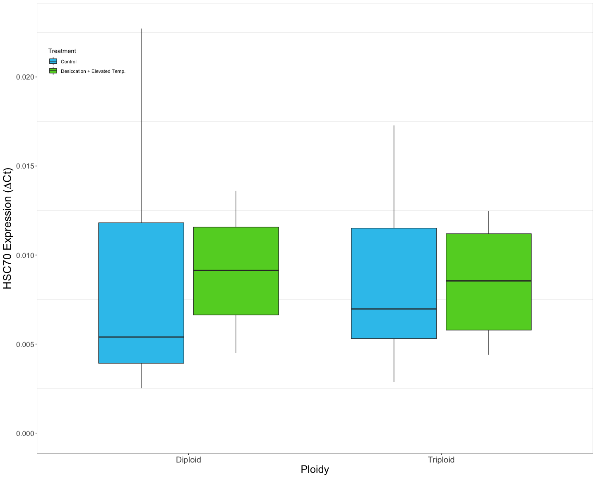

    ## Warning: Removed 1 rows containing non-finite values (stat_boxplot).

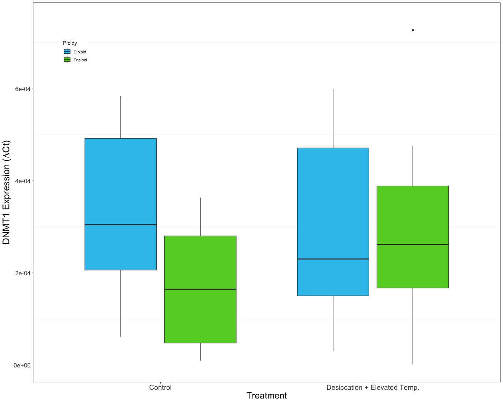

    ## Warning: Removed 4 rows containing non-finite values (stat_boxplot).

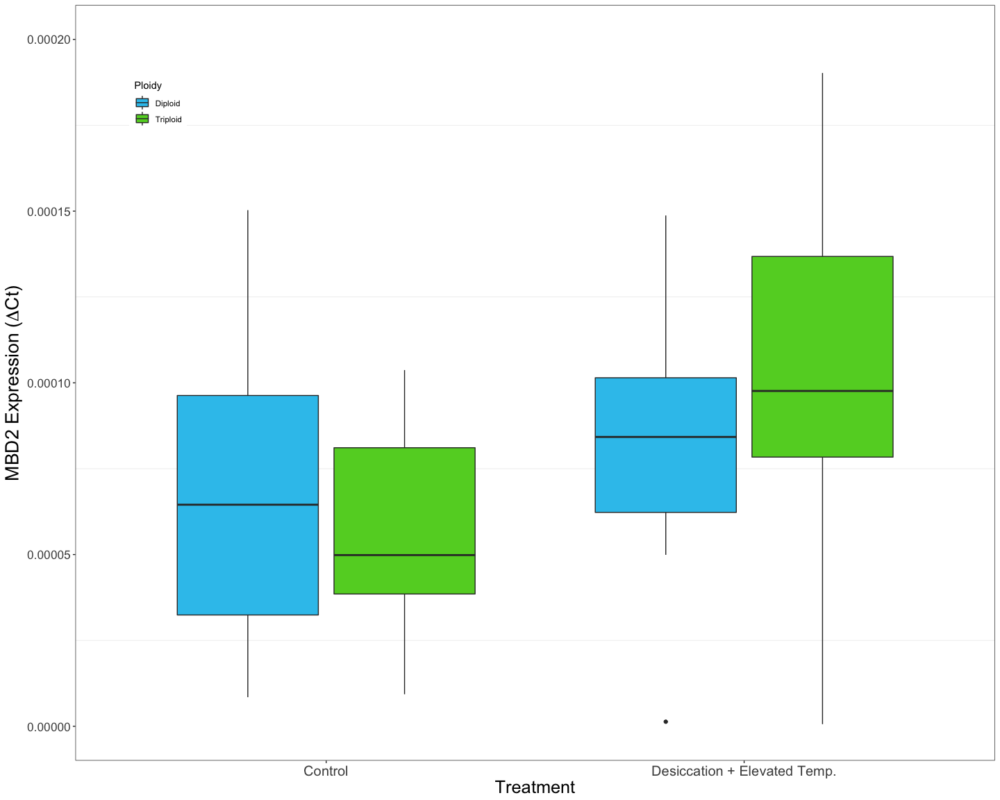

    ## Warning: Removed 3 rows containing non-finite values (stat_boxplot).

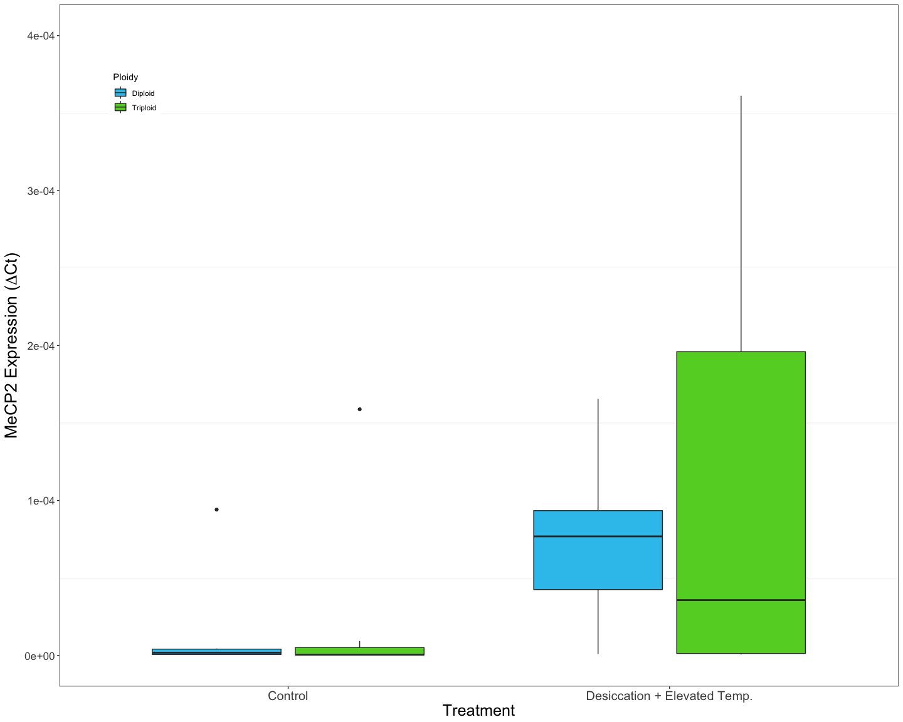

    ## Warning: Removed 3 rows containing non-finite values (stat_boxplot).

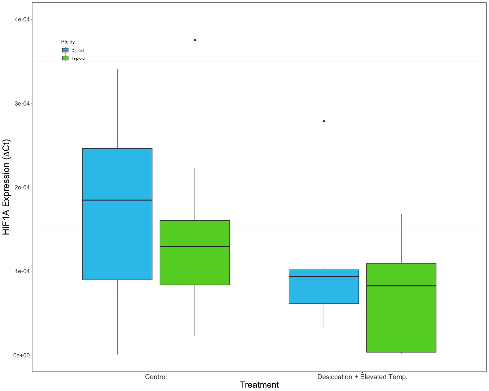

    ## Warning: Removed 3 rows containing non-finite values (stat_boxplot).

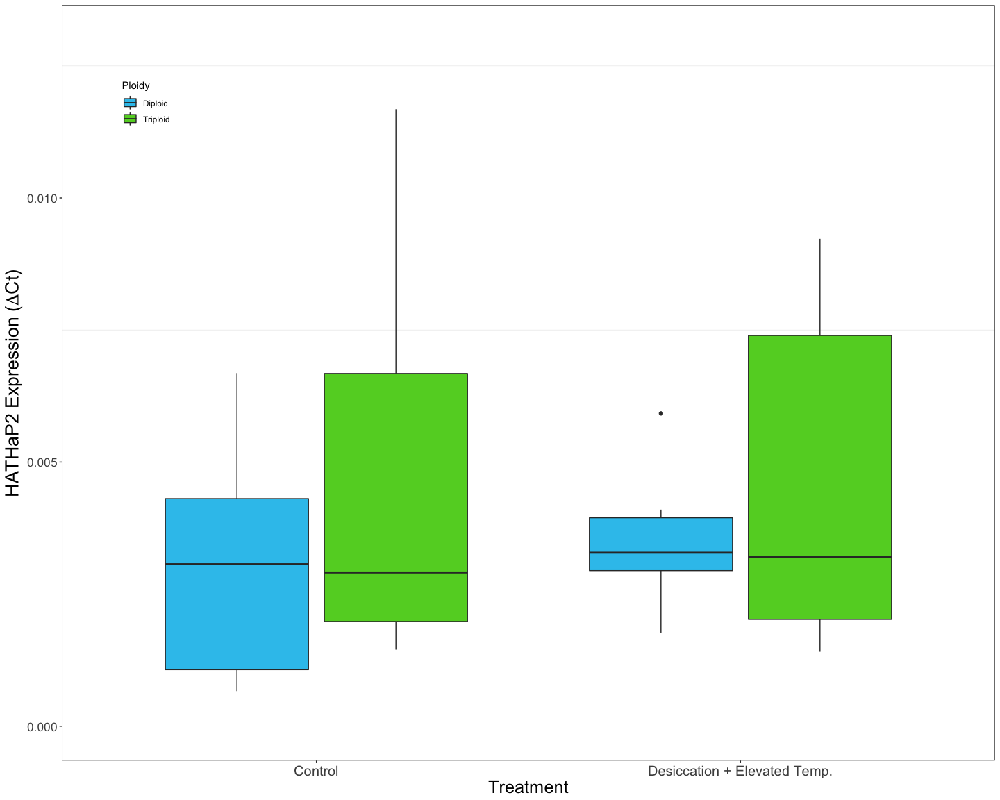

    ## Warning: Removed 4 rows containing non-finite values (stat_boxplot).

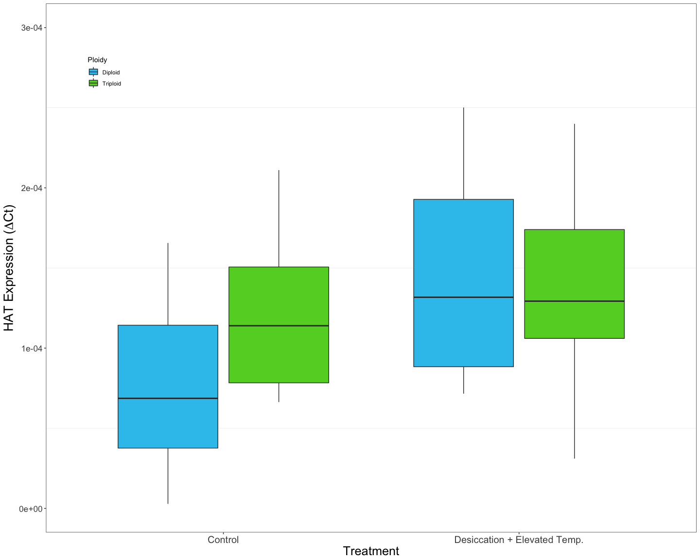

    ## Warning: Removed 5 rows containing non-finite values (stat_boxplot).

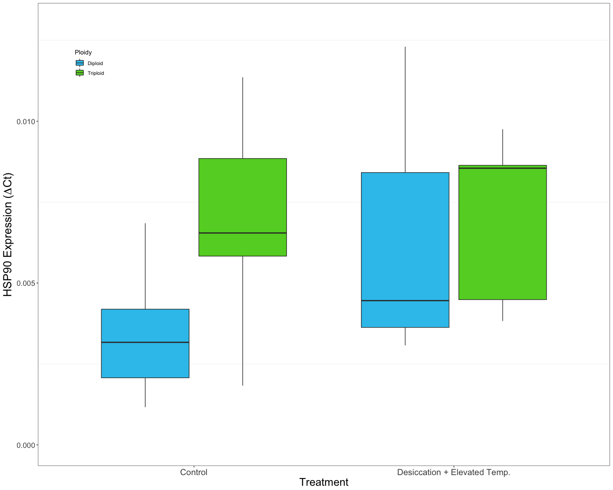

    ## Warning: Removed 4 rows containing non-finite values (stat_boxplot).

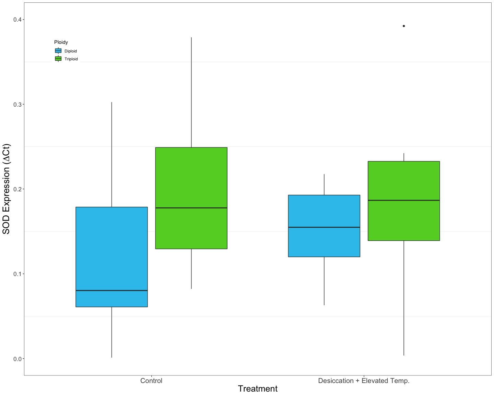

    ## Warning: Removed 2 rows containing non-finite values (stat_boxplot).

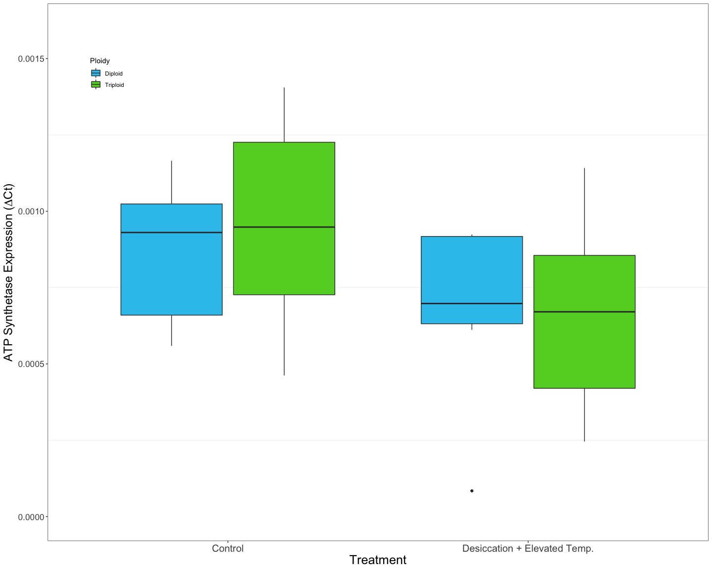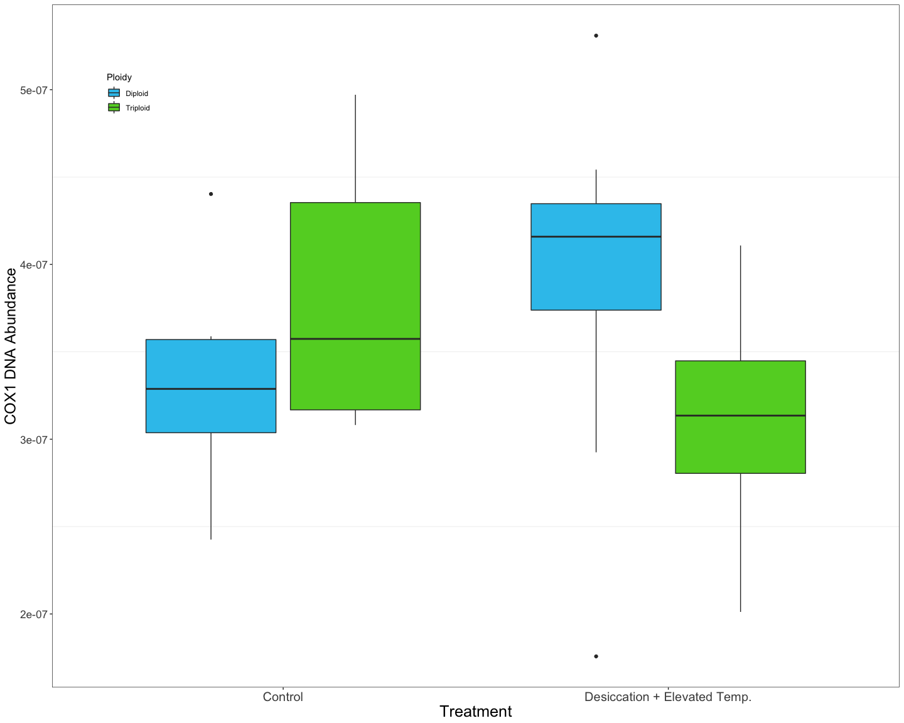
